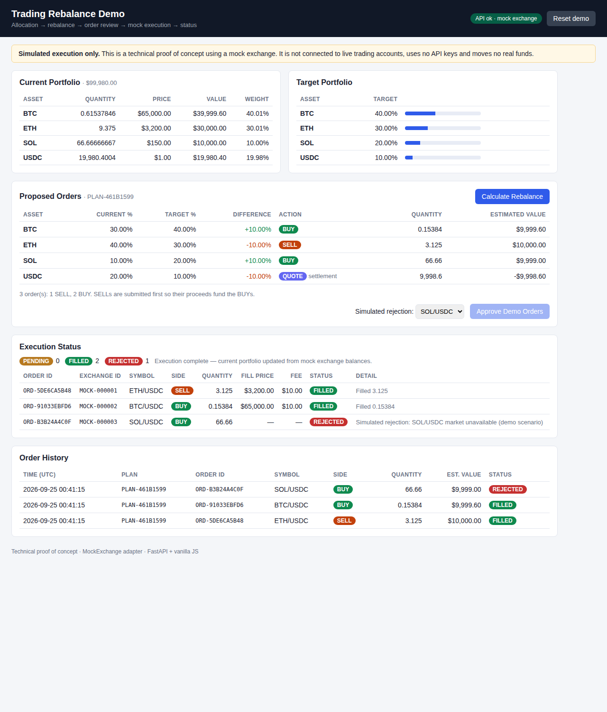

# Trading Rebalance Execution Demo

> **This is a technical proof of concept using simulated exchange execution. It is not connected to live trading accounts.**
> No real funds, no API keys, no live trading. All orders are processed by an in-memory `MockExchange`.

A compact Python / FastAPI service with a small dashboard. It shows the core of a
portfolio rebalancing execution system: allocation drift is turned into validated
BUY/SELL orders, which are submitted through an exchange adapter interface and
tracked through their lifecycle (`PENDING` → `FILLED` / `REJECTED`).



## What the demo shows

- **Rebalance calculation**: current and target values, drift, BUY/SELL/HOLD decisions and
  quantities rounded to lot size. Nothing is hardcoded; the orders are calculated from the inputs.
- **Order generation**: structured order instructions with SELLs first, so their proceeds
  fund the BUYs.
- **Order management**: pre-trade validation, order ID generation, submission, status
  tracking and protection against executing the same plan twice.
- **Exchange abstraction**: an `ExchangeAdapter` interface with a `MockExchange` implementation.
- **Order lifecycle**: asynchronous settlement (`PENDING` → `FILLED`), one simulated
  `REJECTED` order, and insufficient-balance rejections.
- **API + UI**: FastAPI endpoints and an HTML/CSS/JS dashboard that runs the whole flow.

## Architecture

```
 frontend/ (HTML + JS)
        │  REST (JSON)
        ▼
 app/main.py ─────────── FastAPI endpoints, demo state
        │
        ├── rebalance_engine.py   calculate_rebalance(): allocation drift → RebalancePlan
        │
        └── order_manager.py      validate → assign ID → submit → track status
                 │
                 ▼  ExchangeAdapter interface (exchange_base.py)
                 │    get_balance() · get_price() · create_order() · get_order()
                 ▼
            mock_exchange.py      MockExchange: in-memory balances, delayed fills,
                                  fees, rejection rules
```

| File | Responsibility |
|---|---|
| `app/models.py` | Pydantic models: `RebalancePlan`, `OrderInstruction`, `ExchangeOrder`, `ManagedOrder`, enums |
| `app/rebalance_engine.py` | Pure calculation, with no I/O and no exchange dependency |
| `app/exchange_base.py` | `ExchangeAdapter` abstract interface |
| `app/mock_exchange.py` | `MockExchange` implementation of the interface |
| `app/order_manager.py` | `OrderManager`: validation, IDs, submission, status tracking |
| `app/main.py` | FastAPI app and sample data |
| `frontend/` | Dashboard |
| `tests/` | Unit and API tests |

## How the rebalance calculation works

Inputs: current allocation (%), target allocation (%), portfolio value and prices.

For each asset:

```
current_value = portfolio_value × current_pct / 100
target_value  = portfolio_value × target_pct  / 100
difference    = target_value − current_value
action        = BUY if difference > 0, SELL if difference < 0
quantity      = |difference| / price, rounded DOWN to the asset's lot size
estimated     = quantity × price
```

The engine uses `Decimal` arithmetic throughout. It validates that allocations sum to
100%, that there are no negative weights, and that every asset has a positive price.
Trades below a minimum value (default $10) become `HOLD`, so small drift does not
create tiny orders.

**Quote asset.** USDC is the settlement currency. Orders trade `BTC/USDC`, `ETH/USDC`
and so on, so USDC is not traded directly. Its row is marked `QUOTE`, and its change is
the net result of the other orders (sell proceeds minus buy costs).

Sample data ($100,000 portfolio):

| Asset | Price | Current | Target | Result |
|---|---|---|---|---|
| BTC | $65,000 | 30% | 40% | BUY 0.15384 BTC (~$9,999.60) |
| ETH | $3,200 | 40% | 30% | SELL 3.125 ETH ($10,000.00) |
| SOL | $150 | 10% | 20% | BUY 66.66 SOL (~$9,999.00) |
| USDC | $1 | 20% | 10% | QUOTE: net −$9,998.60 |

## How orders are generated and executed

1. `POST /rebalance` returns a `RebalancePlan` (with a `plan_id`) that contains per-asset
   rows and order instructions. SELLs are listed before BUYs.
2. The user reviews the plan and approves it: `POST /orders/execute` with the `plan_id`.
3. `OrderManager` checks each instruction before it is sent:
   - quantity and price are positive, and the side is valid
   - order value is within the min/max limits
   - the exchange supports the symbol
   - the market price has not moved more than 5% since the plan was calculated
   An instruction that fails validation is recorded as `REJECTED` and never reaches the exchange.
4. Valid orders get an internal ID (`ORD-…`) that is sent as the `client_order_id`. The
   exchange returns its own ID (`MOCK-…`) and the order starts as `PENDING`.
5. `GET /orders` and `GET /orders/{id}` poll the exchange for pending orders and update
   their status.
6. A plan can only be executed once. A second attempt returns `409`.

## How the mock exchange works

`MockExchange` implements `ExchangeAdapter` fully in memory:

- Balances start from the sample allocation. Prices are fixed sample prices.
- `create_order` validates the symbol and quantity and returns a `PENDING` order.
- Orders settle after a configurable delay, in submission order, the next time the
  exchange is queried. In the UI they settle one by one, which shows the
  `PENDING` → `FILLED` transition.
- On settlement:
  - **BUY**: requires `qty × price + fee` in USDC, otherwise `REJECTED` (insufficient balance).
  - **SELL**: requires `qty` of the base asset, otherwise `REJECTED`.
  - Fills move balances and charge a 0.1% fee.
- **Rejection rules**: `set_rejection_rule("SOL/USDC", reason)` makes that market reject
  orders. The dashboard uses this to demonstrate a `REJECTED` order (SOL by default;
  selectable, or "None").

After execution, the "Current Portfolio" panel is rebuilt from the mock exchange balances.
Clicking **Calculate Rebalance** again proposes only the remaining drift, which is the
rejected SOL order.

## Running the project

Requires Python 3.10+.

```bash
cd trading-rebalance-demo
python -m venv .venv && source .venv/bin/activate
pip install -r requirements.txt
uvicorn app.main:app --reload
```

Open <http://localhost:8000>. Interactive API docs are at <http://localhost:8000/docs>.

Optional settings: `MOCK_FILL_DELAY` (default `2.0`s) and `MOCK_FILL_STAGGER`
(default `1.0`s between orders).

### Demo flow

1. The dashboard shows the current portfolio (30/40/10/20) and the target (40/30/20/10).
2. **Calculate Rebalance**: the proposed BUY/SELL orders appear.
3. **Approve Demo Orders**: orders are submitted and receive order IDs, all `PENDING`.
4. The orders turn `FILLED` one by one. SOL/USDC is `REJECTED` (simulated).
5. The final results and order history are shown, and the current portfolio is updated.
6. **Reset demo** restores the starting state.

### API

| Method | Path | Description |
|---|---|---|
| GET | `/health` | Service status |
| GET | `/portfolio` | Live mock balances, allocation, target, prices |
| POST | `/rebalance` | Calculate a plan. Optional body overrides `current_allocation`, `target_allocation`, `portfolio_value`, `prices` |
| POST | `/orders/execute` | `{"plan_id": "...", "simulate_rejection_asset": "SOL" \| null}` |
| GET | `/orders` | All orders (optional `?plan_id=`) with a status summary |
| GET | `/orders/{order_id}` | Single order status |
| POST | `/demo/reset` | Reset the demo state (a demo convenience, not part of the core API) |

## Running tests

```bash
pytest
```

The tests cover the rebalance calculation, BUY and SELL quantities, lot rounding,
HOLD thresholds, input validation, order generation and ordering, mock execution,
fills and balance changes, rejections (rule-based, insufficient balance and
pre-trade validation), duplicate plan execution, and the full API flow.

## Extending towards production

This demo keeps the boundaries a production system needs, so each part can be
extended on its own:

- **Exchange adapters**: additional exchange adapters such as Binance or Kraken can be
  implemented using the same interface during the production integration. `OrderManager`
  depends only on `ExchangeAdapter`.
- **Order types and execution**: limit orders, partial fills, order slicing / TWAP for
  large rebalances, and cancel/replace.
- **Status updates**: exchange WebSocket user-data streams instead of polling.
- **Persistence**: a database for plans, orders and fills, plus an audit trail.
- **Risk controls**: per-asset and portfolio limits, exposure checks and kill switches.
- **Security and custody**: authentication, secrets management, and the key-handling /
  signing model the deployment requires.
- **Strategy input**: the target allocation would come from the client's own allocation
  model instead of sample data.

These items are intentionally not implemented here. See `DEMO_NOTES.md`.
